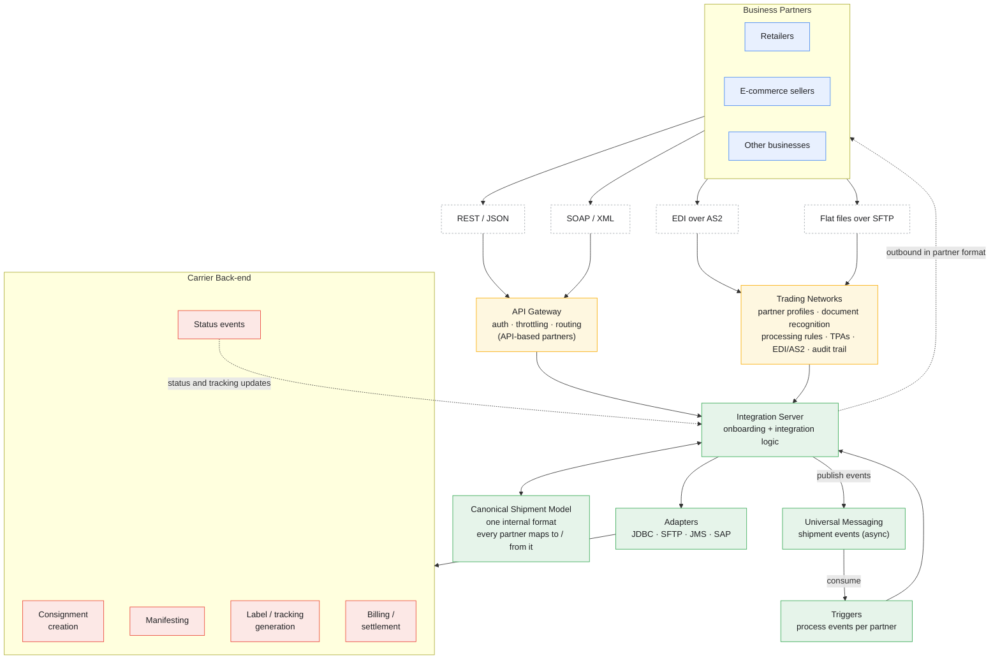

# Interview Project Story — Carrier Partner-Onboarding Platform

*How to turn a real project into a senior interview story that hits almost every line of the job description. Client and partner names are deliberately left out — describe it generically, the way a professional under an NDA would.*

---

## Read this first — two ground rules

**1. Names stay out.** Refer to "a large parcel-delivery and logistics company," "the carrier's platform," and "business partners" or "the partners being onboarded." Naming the client or its partners in an interview reads as careless with confidentiality; leaving them out reads as professional. Interviewers can evaluate the work without the brand names.

**2. The honesty rule.** Everything below maps the project onto a **likely** webMethods architecture so you can talk fluently. You were there and I wasn't. Before you use any specific:

- Keep what's true. Say "I designed that" or "I built that" where you did.
- Soften what you only worked next to. "The team did X; my part was Y."
- **Delete anything you can't defend.** One invented detail an interviewer pulls on, and can't back up, does more damage than a modest, true story. "I didn't own that piece, here's how it worked" beats bluffing every time.

Treat this as a scaffold, not a script.

---

## Part 1: What the project actually was

A large parcel-delivery and logistics company ran a parcel network, and wanted to **onboard many different business partners** onto its platform — retailers, e-commerce sellers, and similar businesses — so each partner could lodge parcels and exchange shipment data through the carrier's network. (A national convenience-store chain with in-store parcel lodging and lockers was one such partner; there were others.)

The recurring challenge: every partner needed the same handful of things — send a shipment/lodgement order, get back a label and tracking number, send a manifest, and receive status updates — but each partner had its **own systems, own data formats, and own preferred transport.** Some spoke REST/JSON, some SOAP/XML, some exchanged EDI over AS2 or flat files over SFTP.

So this is fundamentally a **B2B partner-onboarding and integration platform** — and that's the single most JD-relevant kind of project you could name, because the role explicitly asks for "Build B2B integrations using EDI, AS2, and Trading Networks."

---

## Part 2: The 90-second version (your opener)

When they ask "tell me about a complex integration you've worked on," lead with something like this, swapping in your real details (marked `[...]`):

> "The one I'm proudest of is a partner-onboarding and integration platform for a large parcel-delivery and logistics company. They ran a parcel network and wanted to onboard a lot of different business partners — retailers, e-commerce sellers and the like — so those partners could lodge parcels and exchange shipment data through the carrier's network. I was the **integration designer**: I owned the onboarding and integration design, the canonical shipment model everything normalised to, and the per-partner interface specs, and I was hands-on building them, on a team of `[size]`, over `[duration]`.
>
> The hard part was that every partner needed the same things — create a shipment, get a label and tracking number, send a manifest, receive status — but each came with a different format and a different transport. Some used REST, some SOAP, some EDI over AS2, some flat files over SFTP. So I designed it around a **canonical shipment model** with **Trading Networks** managing the partners. Each partner mapped to and from one internal format, with its own profile and processing rules. Onboarding a new partner became a profile, a mapping, and config — not a rebuild. That repeatable onboarding pattern is what let the business scale to many partners.
>
> It had to be reliable and observable across all those partners — async messaging so one partner or downstream system being down didn't block others, full tracking of every shipment event, and proper error handling with resubmission."

The shape: business problem → why it was hard → the design choice that solved it (canonical model + Trading Networks onboarding) → reliability at scale. Then stop and let them probe.

---

## Part 3: The likely architecture (so you can go deep)

A plausible webMethods picture. Use the pieces you recognise; drop the ones that don't match what you designed.

### The pieces, and what you'd say about each

**Trading Networks — the centre of a partner-onboarding platform.** This is where the story is strongest now. TN manages **partner profiles** (who each partner is, their IDs, certificates, delivery methods), **document recognition** (work out which partner sent what and which document type), **processing rules** (per-partner handling — partner A's orders run this service, partner B's run that), and **TPAs (Trading Partner Agreements)** for partner-specific settings. It also keeps the **full audit trail** of every B2B document in and out, with resubmission. Onboarding a partner *is* setting up its profile, agreement, recognition, and rules. As the integration designer, you designed that onboarding pattern — own it.

**Canonical shipment model — your design centrepiece.** Instead of mapping every partner's format straight to the carrier's back-end, you defined one internal "shipment / consignment / status" model. Each partner maps to and from it. Adding a partner became a new mapping plus profile, not a rebuild. This is the design decision that made onboarding scalable, and it was yours to make.

**Per-partner interfaces in different flavours.** You designed and built the inbound and outbound interfaces for each partner:
- Inbound: receive a shipment/lodgement order (REST, SOAP, EDI, or file), validate it, normalise to the canonical model, create a consignment in the carrier's back-end.
- Outbound: send back the label and tracking number, then push status updates (in transit, delivered, exception) in the partner's expected format.

This covers "create and maintain REST and SOAP web services," "work with APIs," and "prepare integration specifications" straight from the JD.

**AS2 and EDI for the partners that used them.** Logistics partners commonly exchange EDI (X12 or EDIFACT) — shipment orders, manifests, status — over **AS2** for secure, signed, receipted transport, with **MDN** receipts proving delivery. Managed through TN. Claim this for the partners that actually used it; some partners were pure REST. Be clear which were which.

**Async messaging for shipment events.** A shipment's life is a chain of events: lodged, manifested, collected, in transit, delivered. Doing these synchronously would be fragile — one slow partner callback or a downstream outage shouldn't block everyone. So the design **publishes events to Universal Messaging** and **triggers** process them per partner. A partner or back-end being down means events queue and process on recovery. Designing that resilience in is exactly an integration designer's job.

**API Gateway.** The secure front door for the API-based partners — authentication (keys/OAuth/JWT), rate limiting and throttling so a busy partner couldn't swamp shared back-end capacity, and routing. Protects the carrier's back-end from the partners.

**Adapters.**
- **JDBC** to the platform database — partners, shipments, status, audit.
- **SFTP/FTP** for partners and downstream systems that exchanged files (manifests, batch status).
- **JMS** for event messaging.
- Possibly **SAP**, if the carrier did billing/settlement or finance in SAP — partner usage feeding invoicing is a natural fit.

---

## Part 4: How this project hits the job description (your cheat sheet)

This is why the story is so useful — you can point at the JD and say "I designed and built that." Match your real work to these:

| Job description asks for | What you can say from this project |
|---|---|
| Build B2B integrations using EDI, AS2, and Trading Networks | The whole platform was B2B partner onboarding — TN profiles, rules, EDI/AS2. This is the headline match. |
| Develop integrations on Integration Server and Designer | The onboarding and integration layer was designed and built here. |
| REST and SOAP web services | Partner interfaces — REST for some, SOAP for others — plus exposed APIs. |
| Work with APIs, microservices, middleware | The platform was the middleware between many partners and the carrier's network. |
| Adapters: JDBC, SAP, JMS, FTP/SFTP | JDBC to the platform DB; SFTP for partner files; JMS for events; SAP if billing was in scope. |
| Troubleshoot integration and performance issues | Partner format changes, slow partner callbacks, manifest mismatches, cert expiries on AS2/SFTP. |
| Deploy across dev, QA, production | The promotion path you used. |
| Collaborate with BAs, architects, DevOps, support | Worked with the carrier's business team, each partner's technical contacts, ops. |
| Technical documentation and integration specs | Per-partner interface specs and mappings — core designer deliverables. |
| Monitor and optimise performance and reliability | Many partners on shared capacity; had to be reliable and observable. |
| SOA and enterprise integration patterns | Canonical model, content-based routing per partner, async messaging, partner onboarding pattern. |
| API Gateway, Universal Messaging, Trading Networks | All plausibly central — claim the ones you used. |

The B2B / Trading Networks line is now a direct, top-of-list hit — that alone makes this the right project to lead with.

---

## Part 5: Project-specific follow-up probes (rehearse these)

A good interviewer won't take the headline — they'll dig. Prepare answers in your own words, from real memory.

**On partner onboarding (your strongest ground now):**
- "Walk me through onboarding a brand-new partner end to end." → Set up the partner profile and IDs in TN, agree transport (API / EDI over AS2 / SFTP) and document formats, configure recognition and processing rules, build the mapping to and from the canonical model, set up certificates if AS2/SFTP, test in a lower environment, then go live with monitoring.
- "A new partner sends a format you've never seen. What changes, and what stays the same?" → A new mapping and partner profile and recognition rule change; the canonical model and the downstream carrier logic stay the same. That separation is the whole point of the design.
- "How did Trading Networks know which partner sent a document and what it was?" → Recognition by sender/receiver IDs and document type (for EDI, the ISA/GS/ST envelope), tied to the partner profile.
- "How did you keep one partner's processing from affecting another's?" → Per-partner processing rules and profiles; isolation in the design; per-partner monitoring and limits.

**On EDI / AS2 (be ready if a partner used them):**
- "How did you guarantee a partner received a document?" → The signed AS2 MDN — non-repudiation.
- "Sync versus async MDN — when would a partner want async?" → When their processing takes time or for reliability; the MDN comes back later as a separate inbound message.
- "What's a 997 / CONTRL?" → The functional acknowledgement back to the partner that you received and structurally validated their document.

**On reliability and scale:**
- "A downstream system is down for an hour. What happens to shipments coming in from partners?" → Events queue in Universal Messaging; processing retries and completes on recovery; partners aren't blocked.
- "How did you stop a duplicate lodgement creating two consignments?" → Idempotency on a unique shipment ID; exactly-once / duplicate detection on the trigger.
- "Across many partners on shared capacity, how did you protect the back-end?" → API Gateway rate limiting/throttling per partner, right-sized pools, async buffering.

**On troubleshooting (have one real story ready):**
- "Tell me about a production issue on this project." → Pick a real one: a partner changed their format without warning, a manifest count mismatch, an AS2/SFTP certificate expiry, a backlog from a slow downstream system. Walk through how you found it (TN console, Monitor, logs, the document's audit trail), the fix, and what you changed so it wouldn't recur.

**On the designer role specifically:**
- "What design decisions were yours versus the architect's?" → Be clear about your scope: the onboarding pattern, the canonical model, the per-partner interface contracts, the messaging and error-handling design. If a solution architect set the overall platform shape, say so — owning your real boundary reads as senior.
- "What did your integration specifications contain?" → Per-partner interface contracts, the canonical model definition, mappings, recognition and processing rules, error/retry handling, message flows, and non-functional requirements (volumes, timeouts, SLAs).

**On collaboration:**
- "Who did you work with?" → BAs for requirements, the architect for platform shape, each partner's technical contacts for their interface specs, ops/support for go-live, and likely a recurring onboarding cadence as new partners came on.

---

## Part 6: Three stories to write out before the interview

Write these out (a few sentences each) from real memory, using situation -> what you did -> result:

1. **The design story** — the canonical model plus Trading Networks onboarding pattern, and why it was the right call for scaling to many partners. *Your strongest card, and it's a design story, which fits the designer role.*
2. **The incident story** — one real production problem you diagnosed and fixed.
3. **The collaboration / onboarding story** — onboarding a tricky partner whose spec didn't match reality, and how you sorted it with the people involved.

Almost any behavioural question maps onto one of these three.

---